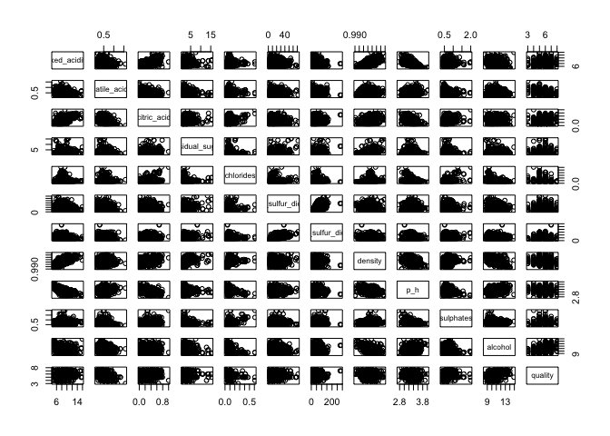
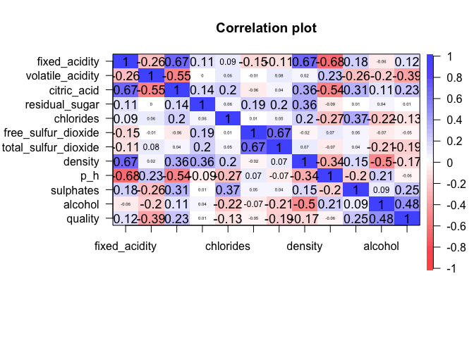
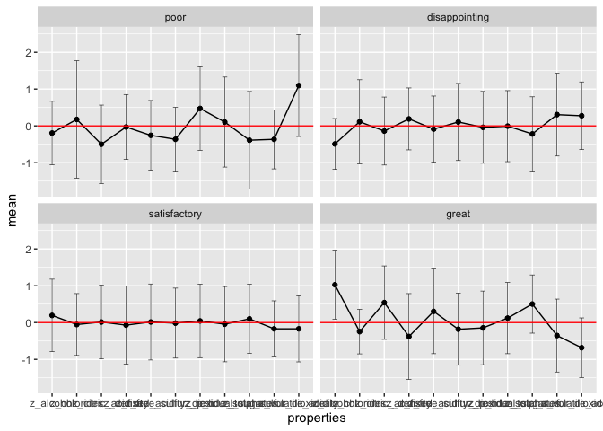
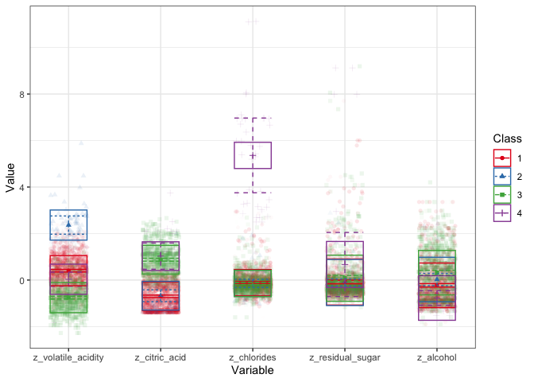
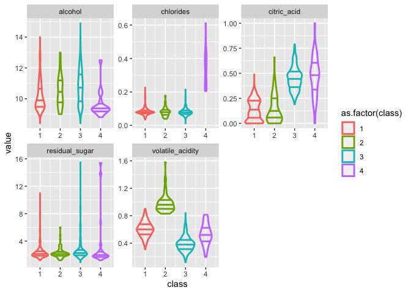
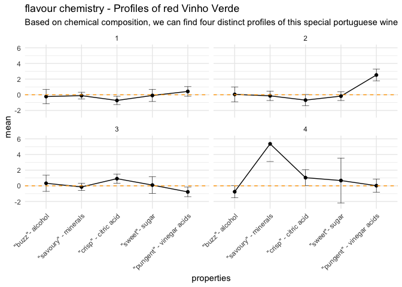
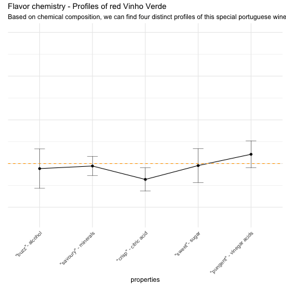
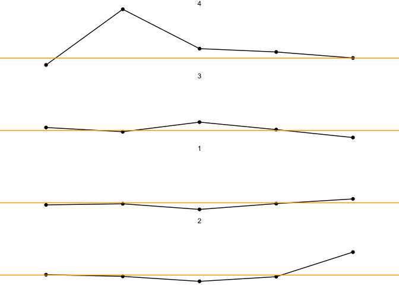
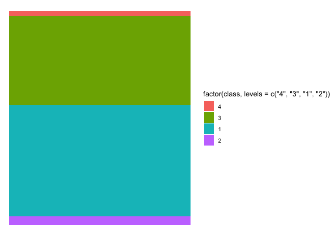

Application as ofqual Research & Data Analyst
================
Theresa Elise Wege

- <a href="#profiling-the-flavour-chemistry-of-red-vinho-verde"
  id="toc-profiling-the-flavour-chemistry-of-red-vinho-verde">Profiling
  the “flavour chemistry” of red Vinho Verde</a>
  - <a href="#the-data" id="toc-the-data">The Data</a>
  - <a href="#my-research-question" id="toc-my-research-question">My
    Research Question</a>
  - <a href="#analysis" id="toc-analysis">Analysis</a>
    - <a href="#libraries" id="toc-libraries">Libraries</a>
    - <a href="#data-cleaning" id="toc-data-cleaning">Data Cleaning</a>
    - <a href="#descriptives-and-exploration"
      id="toc-descriptives-and-exploration">Descriptives and Exploration</a>
    - <a href="#profile-exploration" id="toc-profile-exploration">Profile
      Exploration</a>
    - <a href="#latent-profile-analysis"
      id="toc-latent-profile-analysis">Latent Profile Analysis</a>
    - <a href="#profiles-and-wine-quality"
      id="toc-profiles-and-wine-quality">Profiles and wine quality</a>
  - <a href="#results--presentation" id="toc-results--presentation">Results
    &amp; Presentation</a>
  - <a href="#reflections-on-this-task"
    id="toc-reflections-on-this-task">Reflections on this task</a>
    - <a href="#lost-along-the-way" id="toc-lost-along-the-way">Lost along the
      way</a>
    - <a href="#the-power-of-working-in-a-team"
      id="toc-the-power-of-working-in-a-team">The power of working in a
      team</a>

# Profiling the “flavour chemistry” of red Vinho Verde

## The Data

Vinho Verde is a Portuguese wine. It is special, because it is a “young
wine” that is being bottled very soon after the grape harvest.

The flavour of Vinho Verde, like any wine, develops during fermentation.
Fermentation is a chemical process in which the sugar that naturally
occurs in the grapes turns into alcohol. During fermentation, other
chemical processes also influence the flavour of the finished wine. Some
chemical components may even be added during fermentation to further
develop and preserve the wine’s flavour.

This dataset contains a physicochemical analysis of 1599 different red
Vinho Verde. It includes measurements associated with the chemical
processes that occur during fermentation and which result in a wine’s
unique flavour. It also includes information about how the quality of
these wines has been judged by a panel of experts.

This is a popular dataset for the use of machine learning to classify
and predict and outcome (wine quality) based on a number of features
(physicochemical measurements). The finding from such analyses is that
wine quality can be very accurately predicted based on the
physicochemical measurements.

## My Research Question

I wanted to do something different with this dataset. Knowing little
about wine, what initially struck me as very interesting is that certain
physicochemical measurements are associated with particular aspects of
the wine’s flavour.

In the supermarket we see wines being described as more or less “dry” or
“fruity”. But maybe looking at the “flavour chemistry” can uncover more
interesting profiles? Maybe we can even find a profile of “flavour
chemistry” that is common to Vinho Verdes of the greatest quality… or
the poorest?

This notebook details my journey through this analysis.

The final result of my analysis and research is the below info-graphic
on “Profiling the flavour chemistry of red Vinho Verde”.


## Analysis

### Libraries

These are the libraries I used for this project.

``` r
library (here) # setting wd for project
library (tidyverse) # data wrangling
library (janitor) #cleaning variable names
library (plotly) #correlation plot
library(psych) #statistics 
library(tidyLPA) #latent profile analysis
library(svglite) #export ggplot to svg editable graphic
```

### Data Cleaning

I cleaned the variable names, added a unique identifier column,
z-transformed the chemical variables and re-coded quality into four
categories according to the labels that I found were generally
associated with the 10-point quality scale.

``` r
here() #sets wd to folder containing this project, which also contains the wine.csv
```

    ## [1] "/Users/pia-admin/Library/CloudStorage/OneDrive-LoughboroughUniversity/Job applications/ofqual_DataAnalyst_Feb23/homework"

``` r
raw_wine <- read_csv("red_wine_data.csv") %>% 
  clean_names() #use janitor pckg to remove capitals, spaces etc from variable names

z_wine <-
raw_wine %>% 
  mutate(across(c(fixed_acidity:alcohol), ~ as.numeric(scale(., center = T, scale = T)))) %>% 
  rename_with( ~ paste0("z_", .x)) %>% rename(quality = z_quality) %>% 
  mutate(unique_id = row_number())  %>% 
  mutate(quality = case_when(quality < 5 ~ "poor",
                             quality == 5  ~ "disappointing",
                             quality == 6 ~ "satisfactory",
                             quality > 6 ~ "great"),
         quality = factor(quality, levels= c("poor", "disappointing", "satisfactory", "great")))

z_wine_longer <-
  z_wine %>% 
  pivot_longer(cols = z_fixed_acidity:z_alcohol, names_to = "properties", values_to = "value")
```

### Descriptives and Exploration

This is unbalanced data; there are more disappointing and satisfactory
wines than great or poor ones.

There were some interesting inter-correlations between the chemical
variables. E.g., the different types of acidity were correlated with
each other and with pH, density was correlated with residual sugar and
with alcohol. To understand this data and its structure better, I did
some research on these different chemical properties of wine. E.g., I
learned that density correlated negatively with alcohol and positively
with residual sugar, because density is a way to measure the state of
the fermentation process during which sugars are transformed into
alcohol.

Quality was most strongly correlated with alcohol (positive) and
volatile acidity (negative). I wondered if I would see this as a very
pronounced difference when I looked at the chemical profiles across the
different wine qualities.

``` r
table(raw_wine$quality)
```

    ## 
    ##   3   4   5   6   7   8 
    ##  10  53 681 638 199  18

``` r
table(z_wine$quality)
```

    ## 
    ##          poor disappointing  satisfactory         great 
    ##            63           681           638           217

``` r
pairs(raw_wine[,1:12])
```

<!-- -->

``` r
corPlot(raw_wine[,1:12])
```

<!-- -->

### Profile Exploration

I split the data set into the four levels of wine quality and plotted a
profile of the chemical variables for each. Since all variables were
standardised, the red marked line at zero represents the value of an
average wine.

The profiles for disappointing and satisfactory wines were
unsurprisingly “flat”. Those wines make up most of the sample, so they
will be closest to the “average wine” that is represented here by the
red line. It was however interesting to notice that there were quite
visible differences at the top and bottom of wine quality. There is
still considerable variation (see errorbars), but a few chemical
properties seem to differ between wine qualities. I particularly noticed
the profile of alcohol, total sulfur dioxide and volatile acidity being
different across qualities.

``` r
z_wine_longer %>% 
  group_by(quality,properties) %>% 
  summarise(mean = mean(value), sd = sd(value)) %>% 
  ungroup() %>% 
  ggplot(aes(properties, mean, group = quality)) +
  geom_point() +
  geom_line() +
  geom_errorbar(aes(ymax = mean + sd,
                      ymin = mean - sd),
                  size = 0.2, width = 0.2) +
  geom_hline(yintercept = 0, color = "red") +
  facet_wrap(~quality)
```

<!-- -->

At this point, I had a good overview of the data. I knew that there was
quite a bit of inter-dependency between some variables, that there was
an interesting potential for finding profiles that are associated with
wine qualities and I was armed with some beginner-level knowledge of
wine tasting.

Bringing all of this information together, I decided to explore the
chemical profiles further. I decided to only focus on a few variables
that seemed interesting, informative and promising in differentiating
profiles.

The variables I focused on for my “flavour chemistry” profiles were:

- **alcohol** - during fermentation sugar is processed into alcohol,
  vinho verde should not contain more than 11.5% alcohol, which is quite
  low compared to other wines

- **residual sugar** - any sugar that is not processed into alcohol;
  gives the wine its “sweetness”

- **citric acid** - may occur naturally or can be added in the making;
  gives a “crisp” and “fresh” flavour

- **volatile acidity** - an undisirable acid that is created by bacteria
  during fermentation; gives “vinegar” flavours

- **chlorides** - naturally occurring minerals in the grape, depending
  on growing region; gives a “savory” flavour

I initially also considered adding the two below variables but decided
against it.

- **total sulfur dioxide** - a preservative used to prevent bacteria
  during fermentation, indicated on a wine’s label as “Contains
  Sulphites”

- **fixed acidity** - acids that occur naturally in the grapes or are
  created during fermentation; adding to “acidity” or “dryness”

Sulfur dioxide did not really fit with my aim to look at profiles that
can be understood and explained in terms of flavour. Fixed acidity was
interesting as another note on acidic flavour and dryness, but it
correlates highly with citric acid. I aimed for quick and easy
interpretability with these “flavour chemistry” profiles, so did not
want to include two indicators for “acidity”. Since citric acid is
particularly associated with a “pleasant” acidity and can both occur
naturally and be added in the wine making, I thought it would be the
more useful and interesting indicator for acidity.

### Latent Profile Analysis

Latent profile analysis (LPA) is a statistical technique that can help
to identify patterns (or latent profiles) in a data set where
observations vary across a series of measurements.

There are different considerations when deciding how many profiles to
extract. Statistical fit indices can help to identify the profile
solution that best “represents” the data set. But, it can also be
important to find a profile solution that “makes sense” in a way that
gives us interesting insights into the data and the associated research
questions.

I experimented quite a bit with this analysis before I settled on my
current solution.

One aspect I was thinking about was choosing a suitable model for my
LPA. Possible models differ in regards to how the variance and
covariance structure across profiles is defined. I initially wanted to
fit the most flexible model in which both variances and covariances are
free to vary across profiles. This model was computationally too
demanding for my laptop, so I re-considered. I settled on fitting a
model with equal variances and equal co-variances, because I wanted to
preserve the correlational structure of the variables across my
profiles.

Another aspect I was thinking about quite a bit was my choice of a
profile solution. This data did not reduce very well to profiles. Even
playing around with different models and input variables, the
statistically best fitting solution often had almost as many profiles as
I used input variables. Because my aim was more exploratory and
descriptive, I decided that it would be best to pick a solution that
“made sense” over a solution that was statistically the best reduction
of the data.

The result is a solution with four latent profiles that I interpreted as
profiles of “flavour chemistry”:

- **the “regular” profile:** contains 51.8% of the wines in this data
  set. It gives you a good idea of a baseline Vinho Verde “flavour
  chemistry”

- **the “pungent” profile:** contains 4.1% of the wines in this data
  set. These wines contain a much higher than average amount of volatile
  acids. These acids are produced during fermentation by bacteria and
  give the wine a “vingar-like” smell and flavour. These acids are
  generally undesired and a large amount of them indicates non-ideal
  fermentation.

- **the “crisp” profile:** contains 41.7% of the wines in this data set.
  These wines contain an above average percentage of alcohol and citric
  acids while only having low amounts of the volatile vinegar acids.
  While vinegar acids give an undesirable flavour, citric acids make the
  wine taste fresh and crisp.

- **the “savoury” profile:** contains only 2.3% of the wines in this
  data set, but are very distinct from the rest. These wines contain a
  large amount of chlorides, which are minerals that can give the wine a
  “salty” and “savoury” flavour. Additionally, these wines are
  characterized by lower percentages of alcohol and can have quite a bit
  of “sweetness” from residual sugars and a “crisp freshness” from
  citric acid.

``` r
#profiles based on a reduced set of variables
profiles_reduced <-
  z_wine %>% 
  select(z_volatile_acidity,z_citric_acid, z_chlorides, z_residual_sugar, z_alcohol) %>% 
  estimate_profiles(4, variances = "equal", covariances = "equal") #fitting a four profile solution with model specifications M3

get_fit(profiles_reduced)
```

    ## # A tibble: 1 × 18
    ##   Model Classes LogLik    AIC    AWE    BIC   CAIC    CLC    KIC  SABIC     ICL
    ##   <dbl>   <dbl>  <dbl>  <dbl>  <dbl>  <dbl>  <dbl>  <dbl>  <dbl>  <dbl>   <dbl>
    ## 1     3       4 -9901. 19878. 20475. 20082. 20120. 19804. 19919. 19961. -20380.
    ## # … with 7 more variables: Entropy <dbl>, prob_min <dbl>, prob_max <dbl>,
    ## #   n_min <dbl>, n_max <dbl>, BLRT_val <dbl>, BLRT_p <dbl>

``` r
plot_profiles(profiles_reduced)
```

<!-- -->

``` r
profiles_wine_reduced <-
  cbind(raw_wine, get_data(profiles_reduced)) %>% 
  select(contains("z_"), volatile_acidity, citric_acid, residual_sugar, chlorides, alcohol, quality, Class) %>% 
  mutate(quality_cat = case_when(quality < 5 ~ "poor",
                             quality == 5  ~ "disappointing",
                             quality == 6 ~ "satisfactory",
                             quality > 6 ~ "great"),
         quality_cat = factor(quality_cat, levels= c("poor", "disappointing", "satisfactory", "great"))) %>% 
  clean_names()

#quick overview of descriptive statistics across profiles
profiles_wine_reduced %>% 
  select(alcohol, citric_acid, residual_sugar, chlorides, volatile_acidity, quality, class) %>%
  describeBy(., group = "class")
```

    ## 
    ##  Descriptive statistics by group 
    ## class: 1
    ##                  vars   n  mean   sd median trimmed  mad  min   max range skew
    ## alcohol             1 829 10.18 0.96   9.90   10.04 0.74 8.40 14.00  5.60 1.42
    ## citric_acid         2 829  0.13 0.10   0.12    0.12 0.15 0.00  0.49  0.49 0.33
    ## residual_sugar      3 829  2.41 1.09   2.10    2.20 0.44 1.20 11.00  9.80 3.74
    ## chlorides           4 829  0.08 0.02   0.08    0.08 0.01 0.03  0.23  0.19 2.25
    ## volatile_acidity    5 829  0.60 0.11   0.60    0.60 0.10 0.31  0.90  0.59 0.09
    ## quality             6 829  5.45 0.67   5.00    5.42 0.00 3.00  8.00  5.00 0.25
    ## class               7 829  1.00 0.00   1.00    1.00 0.00 1.00  1.00  0.00  NaN
    ##                  kurtosis   se
    ## alcohol              1.98 0.03
    ## citric_acid         -1.02 0.00
    ## residual_sugar      18.97 0.04
    ## chlorides           10.31 0.00
    ## volatile_acidity    -0.18 0.00
    ## quality              0.58 0.02
    ## class                 NaN 0.00
    ## ------------------------------------------------------------ 
    ## class: 2
    ##                  vars  n  mean   sd median trimmed  mad  min   max range skew
    ## alcohol             1 66 10.47 1.00  10.20   10.40 1.04 9.00 13.00  4.00 0.54
    ## citric_acid         2 66  0.14 0.14   0.09    0.12 0.11 0.00  0.66  0.66 1.27
    ## residual_sugar      3 66  2.29 0.79   2.10    2.18 0.30 1.20  6.00  4.80 2.30
    ## chlorides           4 66  0.08 0.03   0.08    0.08 0.02 0.04  0.18  0.14 1.26
    ## volatile_acidity    5 66  0.98 0.13   0.96    0.96 0.09 0.83  1.58  0.75 2.03
    ## quality             6 66  5.06 1.01   5.00    5.04 1.48 3.00  8.00  5.00 0.24
    ## class               7 66  2.00 0.00   2.00    2.00 0.00 2.00  2.00  0.00  NaN
    ##                  kurtosis   se
    ## alcohol             -0.37 0.12
    ## citric_acid          1.45 0.02
    ## residual_sugar       7.11 0.10
    ## chlorides            2.20 0.00
    ## volatile_acidity     5.50 0.02
    ## quality              0.39 0.12
    ## class                 NaN 0.00
    ## ------------------------------------------------------------ 
    ## class: 3
    ##                  vars   n  mean   sd median trimmed  mad  min   max range skew
    ## alcohol             1 667 10.77 1.10  10.80   10.72 1.33 8.40 14.90  6.50 0.36
    ## citric_acid         2 667  0.45 0.11   0.45    0.44 0.10 0.19  0.79  0.60 0.40
    ## residual_sugar      3 667  2.67 1.50   2.30    2.36 0.52 0.90 15.50 14.60 3.91
    ## chlorides           4 667  0.08 0.02   0.08    0.08 0.02 0.01  0.21  0.20 1.74
    ## volatile_acidity    5 667  0.39 0.11   0.38    0.38 0.10 0.12  0.84  0.72 0.65
    ## quality             6 667  5.94 0.84   6.00    5.93 1.48 3.00  8.00  5.00 0.05
    ## class               7 667  3.00 0.00   3.00    3.00 0.00 3.00  3.00  0.00  NaN
    ##                  kurtosis   se
    ## alcohol             -0.45 0.04
    ## citric_acid         -0.19 0.00
    ## residual_sugar      21.41 0.06
    ## chlorides            6.88 0.00
    ## volatile_acidity     0.82 0.00
    ## quality             -0.22 0.03
    ## class                 NaN 0.00
    ## ------------------------------------------------------------ 
    ## class: 4
    ##                  vars  n mean   sd median trimmed  mad min   max range  skew
    ## alcohol             1 37 9.62 0.83   9.40    9.48 0.30 8.8 12.50  3.70  2.17
    ## citric_acid         2 37 0.47 0.20   0.50    0.47 0.21 0.0  1.00  1.00  0.03
    ## residual_sugar      3 37 3.49 4.03   1.90    2.59 0.30 1.2 15.40 14.20  2.26
    ## chlorides           4 37 0.34 0.11   0.34    0.33 0.11 0.2  0.61  0.41  0.63
    ## volatile_acidity    5 37 0.53 0.15   0.50    0.53 0.13 0.2  0.81  0.62  0.02
    ## quality             6 37 5.38 0.76   5.00    5.39 0.00 3.0  7.00  4.00 -0.34
    ## class               7 37 4.00 0.00   4.00    4.00 0.00 4.0  4.00  0.00   NaN
    ##                  kurtosis   se
    ## alcohol              4.63 0.14
    ## citric_acid          0.12 0.03
    ## residual_sugar       3.47 0.66
    ## chlorides           -0.05 0.02
    ## volatile_acidity    -0.58 0.02
    ## quality              1.23 0.12
    ## class                 NaN 0.00

``` r
  profiles_wine_reduced%>% 
  pivot_longer(cols = volatile_acidity:alcohol, names_to = "properties", values_to = "value") %>% 
  ggplot(aes(class, value, color = as.factor(class))) +
  geom_violin(draw_quantiles = c(.25,.5,.75), fill = NA, size = 1)+
  facet_wrap(~properties, scales = "free") 
```

<!-- -->

``` r
profiles_plot <- 
  profiles_wine_reduced %>% 
  pivot_longer(cols = z_volatile_acidity:z_alcohol, names_to = "properties", values_to = "value") %>% 
  group_by(class,properties) %>% 
  summarise(mean = mean(value), sd = sd(value)) %>% 
  ungroup() %>% 
  ggplot(aes(properties, mean, group = class)) +
  geom_point() +
  geom_line() +
  geom_errorbar(aes(ymax = mean + sd,
                      ymin = mean - sd),
                  size = 0.2, width = 0.2) +
  geom_hline(yintercept = 0, color = "orange", linetype = "dashed") +
  scale_y_continuous(limits = c(-2.5, 6), )+
  facet_wrap(~class, ncol = 2) +
  theme_minimal() +
  theme(axis.text.x = element_text(angle = 45, hjust=1)) +
  scale_x_discrete(labels = c('"buzz"- alcohol','"savoury" - minerals','"crisp" - citric acid', '"sweet"- sugar', '"pungent" - vinegar acids')) +
  labs(title = "flavour chemistry - Profiles of red Vinho Verde", , subtitle = "Based on chemical composition, we can find four distinct profiles of this special portuguese wine")

profiles_plot
```

<!-- -->

Just for fun, I also wanted to make an animated version of this plot.

``` r
animate_profiles <-
  profiles_wine_reduced %>% 
  pivot_longer(cols = z_volatile_acidity:z_alcohol, names_to = "properties", values_to = "value") %>% 
  group_by(class,properties) %>% 
  summarise(mean = mean(value), sd = sd(value)) %>% 
  ungroup() %>% 
  ggplot(aes(properties, mean, group = class)) +
  geom_point() +
  geom_line() +
  geom_errorbar(aes(ymax = mean + sd,
                    ymin = mean - sd),
                size = 0.2, width = 0.2) +
  geom_hline(yintercept = 0, color = "orange", linetype = "dashed") +
  scale_y_continuous(name = NULL, limits = c(-2.5, 6), labels = NULL) +
  theme_minimal() +
  theme(axis.text.x = element_text(angle = 45, hjust=1)) +
  scale_x_discrete(labels = c('"buzz"- alcohol','"savoury" - minerals','"crisp" - citric acid', '"sweet"- sugar', '"pungent" - vinegar acids')) +
  labs(title = "Flavor chemistry - Profiles of red Vinho Verde", subtitle = "Based on chemical composition, we can find four distinct profiles of this special portuguese wine")

animate_profiles

anim <- animate_profiles + 
  transition_states(class,
                    transition_length = 2,
                    state_length = 1)
animate(anim)

anim_save("plot.gif", anim)
```



### Profiles and wine quality

In the beginning of this analysis, I explored the “flavour chemistry”
across the different qualities of wines. In that analysis, it looked
like a characteristic of great wines was the combination of relatively
high alcohol content with high citric acid and the lowest levels of
volatile acidity.

The latent profile analysis confirmed that this combination of “crisp
freshness” without much “pungent” vinegar acids but with a bit more of
an alcoholic “buzz” is in fact a distinct profile that can describe 42%
of red Vinho Verde.

Where are the great tasting Vinho Verde among the “flavour chemistry”
profiles? Exploring how the great quality wines are distributed among
the four “flavour chemistry” profiles confirms that almost 80% of the
Vinho Verdes judged as “great” quality fit into this profile. However,
there are great Vinho Verde’s among all profiles.

``` r
#analysis of wine quality across profiles/ crosstable
profiles_wine_reduced %>% 
  group_by(quality_cat) %>% 
  count(class) %>% 
  pivot_wider(id_cols = quality_cat, names_from = class, values_from = n)
```

    ## # A tibble: 4 × 5
    ## # Groups:   quality_cat [4]
    ##   quality_cat     `1`   `2`   `3`   `4`
    ##   <fct>         <int> <int> <int> <int>
    ## 1 poor             32    16    13     2
    ## 2 disappointing   434    32   195    20
    ## 3 satisfactory    323    13   289    13
    ## 4 great            40     5   170     2

## Results & Presentation

I present my findings in an info-graphic. This is aimed at the
lay-person who wants to learn a bit more about wine and enjoys to do so
through data.

My priority was to present the data in context. This is why I changed
some of the terminology around the chemical measurements and included
notes on relatable flavour experiences connected to the different
variables.

I made this info-graphic in powerpoint. The two data visualiations are
based on a stacked bar chart and the profile plot. I exported those as
vector graphics which I then edited to make my final design.

``` r
profile_bar_plot <-
profiles_wine_reduced %>% 
  ggplot(aes(x = 1, fill = factor(class, levels = c("4", "3", "1", "2")))) +
  geom_bar(position = "stack") +
  theme_void()

profile_plot_blank <-
profiles_wine_reduced %>% 
  pivot_longer(cols = z_volatile_acidity:z_alcohol, names_to = "properties", values_to = "value") %>% 
  group_by(class,properties) %>% 
  summarise(mean = mean(value), sd = sd(value)) %>% 
  ungroup() %>% 
  ggplot(aes(properties, mean, group = class)) +
  geom_point() +
  geom_line() +
  geom_hline(yintercept = 0, color = "orange") +
  facet_wrap(~factor(class, levels = c("4", "3", "1", "2")), ncol = 1) +
  theme_void()
```

    ## `summarise()` has grouped output by 'class'. You can override using the
    ## `.groups` argument.

``` r
ggsave(file="profile_bar_plot.svg", plot=profile_bar_plot)
```

    ## Saving 7 x 5 in image

``` r
ggsave(file="profile_plot.svg", plot=profile_plot_blank)
```

    ## Saving 7 x 5 in image

``` r
profile_plot_blank
```

<!-- -->

``` r
profile_bar_plot
```

<!-- -->


## Reflections on this task

I thoroughly enjoyed working on this task. In the past 6 months, I had
mostly worked on writing up my dissertation. It was amazing to again
dive into some programming, learn about a new topic and get creative in
telling a story with these data.

### Lost along the way

Of course, this analysis was not always a straight path. I went off on
tangents that I did not include here and I had some ambitious ideas that
I did not realise. Learning is in the struggle. So I wanted to also
share one example of a struggle that I had during this task.

I started making a small shiny widget that would display wine quality
distributions based on a “flavour profile” input. I stopped working on
this idea, because I did not think it would add much to my presentation.
It works when rendered on a shiny server but it does not render in this
document. Still, here is my initial code and a screenshot.

I learned a lot while working on this part of the project. This was the
first time, I had tried to include a shiny widget into a markdown
document. So, on the technical side, I learned how to set-up a markdown
document such that it would render interactive input. But additionally,
I learned (once again) that the value of any data-driven solution needs
to come from the insights it provides in the context. So although, I had
spent quite some time learning and making this little interactive plot,
I decided that I should stop working on it. I had to realise that I was
going down a “rabbit hole” that would not contribute much to my
analysis.


``` r
inputPanel(
    selectInput("alcohol_level", "Choose alcohol level:",
              choices = list("Any","Low","Medium","High")),
    selectInput("residual_sugar_level", "Choose sweetness (residual sugar) level:",
              choices = list("Any","Low","Medium","High")),
    selectInput("citric_acid_level", "Choose acidity (citric acid) level:",
              choices = list("Any","Low","Medium","High")),
    selectInput("fixed_acid_level", "Choose acidity (natural acid) level:",
              choices = list("Any","Low","Medium","High")),
    selectInput("chlorides_level", "Choose saltiness (chloride) level:",
              choices = list("Any","Low","Medium","High")),
    selectInput("free_sulfur_dioxide_level", "Choose preservative (sulfur_dioxide) level:",
              choices = list("Any","Low","Medium","High"))
  )

renderPlot({
  z_wine %>% 
    filter(
      #alcohol
                 case_when(input$alcohol_level == "Low" ~ pnorm(z_alcohol) < 0.25,
                     input$alcohol_level == "Medium" ~ pnorm(z_alcohol) < 0.75 & pnorm(z_alcohol) > 0.25,
                     input$alcohol_level == "High" ~ pnorm(z_alcohol) > 0.75,
                     input$alcohol_level == "Any" ~ pnorm(z_alcohol) > 0),
       # residual sugar
                  case_when(input$residual_sugar_level == "Low" ~ pnorm(z_residual_sugar) < 0.25,
                     input$residual_sugar_level == "Medium" ~ pnorm(z_residual_sugar) < 0.75 & pnorm(z_residual_sugar) > 0.25,
                     input$residual_sugar_level == "High" ~ pnorm(z_residual_sugar) > 0.75,
                     input$residual_sugar_level == "Any" ~ pnorm(z_residual_sugar) > 0),
      #citric acid
           case_when(input$citric_acid_level == "Low" ~ pnorm(z_citric_acid) < 0.25,
                     input$citric_acid_level == "Medium" ~ pnorm(z_citric_acid) < 0.75 & pnorm(z_citric_acid) > 0.25,
                     input$citric_acid_level == "High" ~ pnorm(z_citric_acid) > 0.75,
                     input$citric_acid_level == "Any" ~ pnorm(z_citric_acid) > 0),
       #fixed acidity
           case_when(input$fixed_acid_level == "Low" ~ pnorm(z_fixed_acidity) < 0.25,
                     input$fixed_acid_level == "Medium" ~ pnorm(z_fixed_acidity) < 0.75 & pnorm(z_fixed_acidity) > 0.25,
                     input$fixed_acid_level == "High" ~ pnorm(z_fixed_acidity) > 0.75,
                     input$fixed_acid_level == "Any" ~ pnorm(z_fixed_acidity) > 0),
        #chlorides
           case_when(input$chlorides_level == "Low" ~ pnorm(z_chlorides) < 0.25,
                     input$chlorides_level == "Medium" ~ pnorm(z_chlorides) < 0.75 & pnorm(z_chlorides) > 0.25,
                     input$chlorides_level == "High" ~ pnorm(z_chlorides) > 0.75,
                     input$chlorides_level == "Any" ~ pnorm(z_chlorides) > 0),
         #free sulfur dioxide
           case_when(input$free_sulfur_dioxide_level == "Low" ~ pnorm(z_free_sulfur_dioxide) < 0.25,
                     input$free_sulfur_dioxide_level == "Medium" ~ pnorm(z_free_sulfur_dioxide) < 0.75 & pnorm(z_free_sulfur_dioxide) > 0.25,
                     input$free_sulfur_dioxide_level == "High" ~ pnorm(z_free_sulfur_dioxide) > 0.75,
                     input$free_sulfur_dioxide_level == "Any" ~ pnorm(z_free_sulfur_dioxide) > 0)
      ) %>% 
      ggplot(aes(quality)) +
      geom_bar()
})
```

### The power of working in a team

While working on this task, it was very obvious to me how much I love
working in a team. I worked on this at home and by myself. This made me
realise exactly how valuable it is to have people around you or in your
team to bounce ideas back and forth or get fresh perspectives on things.
For example, I spent quite a long time learning about the data and the
context of the pyisocometric measurements. But, it all come together
when I was talking about it to my partner while we were grocery
shopping. We looked at the wines on the shelve and through our
conversation, I got the idea of analysing the “flavour chemistry
profiles”. I am very excited to present and discuss this work at the
interview to see it through the critical eyes of a team of analysts.
